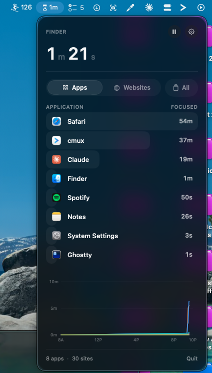
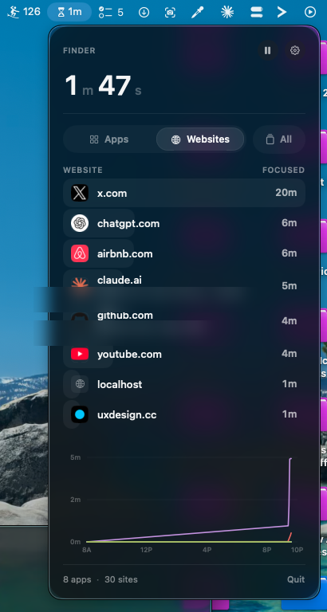
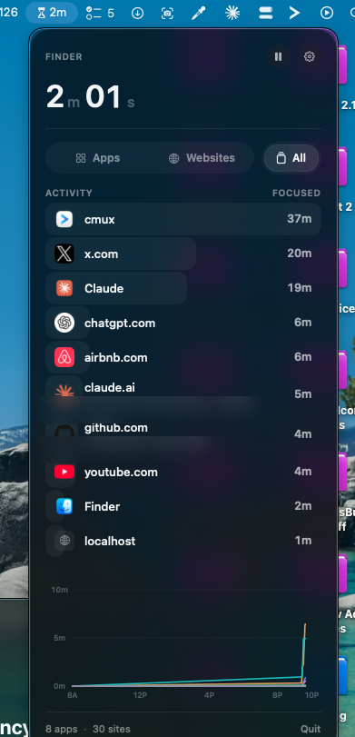
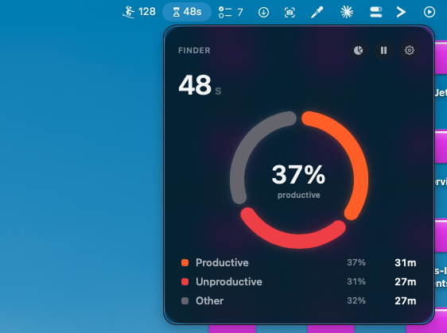
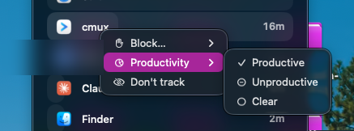

# MacTrack

A free, native macOS menu bar app that shows where your time actually goes: which **apps** you focus on, which **websites** you spend it on, and **how productive** that time is. It can also **block** distracting apps and sites on a locked timer, and **pause overnight**. No account, no subscription, no cloud. It lives in your menu bar, stays out of the way, and keeps every byte of data on your Mac.

Most time trackers are heavy, paid, and want your data. MacTrack is the opposite: one small menu bar app, a clean read on your day, and a database that never leaves your machine.

<p align="center">
  
  
  
</p>

## What it does

- **Tracks focused time, not open windows.** Time counts only for the app you are actually in front of. Background apps never inflate your totals.
- **Tracks individual websites.** When you are in a browser, MacTrack credits time to the site's domain (`youtube.com`, `github.com`), so you see web time the way you experience it. Works with Safari, Chrome, Edge, Brave, Arc, and Vivaldi.
- **Knows when you step away.** Tracking pauses when you go idle or lock the screen, so a coffee break never lands on whatever you left open.
- **Apps, Websites, and All.** Toggle between just apps, just sites, or one merged ranking sorted by time. In the merged view the browser app drops out so its individual sites tell the real story.
- **A clean daily line chart.** The top items plotted across your day, with a hover scrubber for exact values. Set the chart's start and end hours in settings.
- **Glanceable totals.** The menu bar shows live time for whatever you are on right now. Open the popover for the full breakdown.
- **Right-click to ignore.** Don't want something tracked? Right-click any row and choose "Don't track." It disappears and stays gone.
- **A productivity score.** Tag any app or site as productive or unproductive (right-click → **Productivity**). MacTrack rolls your day into a Productive / Unproductive / Other donut so you see your focus at a glance; anything untagged counts as Other.
- **Block distractions.** Right-click anything and block it for 15 minutes to 2 hours. While a block is live there is no off switch — a locked countdown, plus app-hiding and tab-bouncing, keeps you out until it expires. An optional **system-level filter** (a signed Network Extension) makes it DoH-proof and keeps working even if you quit MacTrack — see [SETUP_BLOCKING.md](SETUP_BLOCKING.md).
- **Good-night mode.** One tap stops tracking for the night and auto-resumes at the wake time you set, so late-night idle never skews your day.

## Focus & productivity

Right-click any app or website and mark it **Productive** or **Unproductive**. The pie-chart toggle in the header flips the popover to a productivity overview — one donut splitting your day into Productive / Unproductive / Other, with the productive share called out in the middle. Untagged time is Other, so the picture is honest from day one.

<p align="center">
  
  
</p>

## Privacy

- **Local-first.** Your history lives in a SQLite database at `~/Library/Application Support/MacTrack/`. It is never uploaded anywhere.
- **Domains only.** MacTrack records that you were on a domain and for how long. It never saves page titles or what you were doing on a site.
- **One network call.** The only thing fetched from the internet is website favicons (cached after first use). Everything else is offline.

## Requirements

- macOS 26 or later
- Xcode 26 or later (to build)

## Build and run

The Xcode project is generated from `project.yml` with [XcodeGen](https://github.com/yonaskolb/XcodeGen).

```bash
brew install xcodegen        # once
git clone https://github.com/Entrepenulian/MacTrack.git
cd MacTrack
xcodegen generate            # creates MacTrack.xcodeproj
open MacTrack.xcodeproj       # build & run with ⌘R
```

Or build from the command line:

```bash
xcodebuild -project MacTrack.xcodeproj -scheme MacTrack -configuration Release build
```

Launch at login can be turned on in settings.

## Permissions

To measure per-website time, MacTrack reads the active tab's address through macOS **Automation** (Apple Events). The first time it reads a browser, macOS asks for permission. Allow it, or website time won't be recorded. You can change it later in **System Settings → Privacy & Security → Automation**, or from the gear in MacTrack.

## How it works

A once-a-second sampler measures the real elapsed time between ticks and credits it to whatever is in focus: the frontmost app, and the active tab's domain if that app is a browser. Large gaps (sleep, wake) are dropped, and idle or locked time is skipped. Totals roll up per day; a lightweight per-minute series powers the chart. Writes are incremental and crash-safe (SQLite WAL), with daily backups and automatic restore.

## Tech

Swift, SwiftUI, and AppKit. SQLite via the system library (no third-party dependencies). `MenuBarExtra` for the menu bar surface, Apple Events for browser URLs, and `SMAppService` for launch at login.

```
MacTrack/
  App/        entry point and lifecycle
  Models/     usage records, categories, chart data
  Services/   sampler, browser reader, idle detector, store, database, icons
  Design/     theme tokens, glass, formatters
  Views/      popover, header, list, chart, settings
```

## License

MIT. See [LICENSE](LICENSE).
